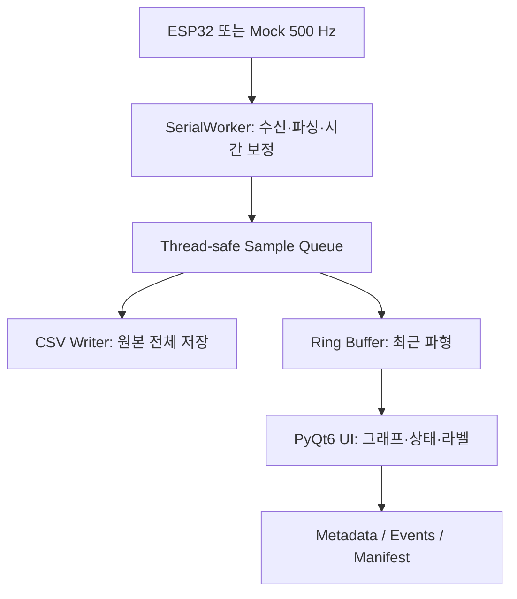

# Codex 작업지시서: ESP32 기반 EMG 데이터셋 수집 프로그램

## 0. 이 문서의 사용 목적

이 문서는 아래 ESP32 시리얼 출력과 호환되는 **근전도(EMG) 데이터셋 수집용 데스크톱 프로그램**을 구현하기 위한 Codex 작업지시서다. 사용자가 별도로 승인하지 않는 한, 웹 앱이 아니라 **Python + PyQt6** 기반으로 구현한다.

완성 프로그램은 다음을 한 번에 수행해야 한다.

- ESP32에서 `ENV`와 `RAW` ADC 값을 500 Hz로 수신한다.
- 수신 중 두 근전도 파형을 실시간으로 표시한다.
- 피험자 정보와 측정 조건을 입력받는다.
- 측정 중 동작/운동 단계 라벨과 이벤트를 기록한다.
- 파형, 메타데이터, 품질 지표를 구조화된 데이터셋으로 저장한다.
- ESP32가 없어도 모의 신호로 전체 기능과 테스트를 실행할 수 있어야 한다.
- 이름과 같은 식별정보는 학습용 신호 파일에서 분리하고, 비식별 데이터셋을 내보낼 수 있어야 한다.

---

## 1. 기준 ESP32 코드와 통신 규격

다음 코드를 현재 하드웨어의 기준으로 사용한다. 첫 구현에서는 사용자의 요청 없이 핀 번호나 출력 열 순서를 바꾸지 않는다.

```cpp
const int ENV_PIN = 33;
const int RAW_PIN = 34;

// 우선 저장 테스트용 500 Hz
const unsigned long SAMPLE_INTERVAL_US = 2000;

unsigned long nextSample = 0;

void setup() {
  Serial.begin(460800);

  analogReadResolution(12);

  analogSetPinAttenuation(ENV_PIN, ADC_11db);
  analogSetPinAttenuation(RAW_PIN, ADC_11db);

  delay(1000);

  // CSV header
  Serial.println("time_us,env,raw");

  nextSample = micros();
}

void loop() {
  unsigned long now = micros();

  if ((long)(now - nextSample) >= 0) {
    nextSample += SAMPLE_INTERVAL_US;

    int envValue = analogRead(ENV_PIN);
    int rawValue = analogRead(RAW_PIN);

    Serial.print(now);
    Serial.print(",");
    Serial.print(envValue);
    Serial.print(",");
    Serial.println(rawValue);
  }
}
```

### 1.1 고정 통신 조건

| 항목 | 값 |
| --- | --- |
| 기본 baud rate | `460800` |
| 목표 샘플링 주파수 | `500 Hz` |
| 목표 샘플 간격 | `2000 us` |
| ESP32 출력 헤더 | `time_us,env,raw` |
| 정상 데이터 예시 | `25224231,1744,875` |
| ADC 해상도 | 12 bit |
| 정상 ADC 범위 | `0~4095` |
| ENV 핀 | GPIO 33 |
| RAW 핀 | GPIO 34 |

ESP32의 `micros()`는 32-bit `unsigned long`이므로 약 **71.58분마다 0으로 순환**한다. PC 프로그램은 이 순환을 감지하여 원본 시간과 순환 보정 시간을 모두 보존해야 한다. 장시간 측정에서 시간 역행이 발생하면 안 된다.

### 1.2 수신 파서 규칙

- UTF-8 또는 ASCII 한 줄 단위로 읽는다.
- 정확히 쉼표로 구분된 3개 열을 정상 데이터 후보로 본다.
- 헤더, ESP32 부팅 메시지, 빈 줄은 무시하되 개수를 진단 정보로 집계한다.
- `time_us`, `env`, `raw`가 정수로 변환되지 않으면 해당 행을 버리고 `malformed_rows`를 증가시킨다.
- ADC 값이 `0~4095` 밖이면 저장하지 않고 `out_of_range_rows`를 증가시킨다.
- 포트가 끊기거나 읽기 예외가 발생해도 GUI 전체가 멈추거나 강제 종료되어서는 안 된다.
- PC 수신 시간은 `time.perf_counter_ns()`를 기준으로 측정하고, 세션 시작의 UTC ISO 8601 시각은 별도 메타데이터에 저장한다.
- 학습용 시간축은 보정된 ESP32 시간인 `device_time_us_unwrapped`를 우선 사용한다.

---

## 2. 기술 선택과 범위

### 2.1 필수 기술 스택

- Python 3.11 이상
- PyQt6
- pyqtgraph
- pyserial
- pydantic 2.x 또는 dataclass 기반의 명확한 데이터 검증 계층
- pytest, pytest-qt
- 표준 `csv`, `json`, `pathlib`, `queue`, `threading` 모듈 우선 사용
- pandas는 내보내기나 요약에 꼭 필요한 경우에만 사용

### 2.2 PyQt6를 선택하는 이유

- Windows COM 포트 접근이 단순하고 안정적이다.
- 브라우저별 Web Serial 지원 및 권한 차이를 피할 수 있다.
- 500 Hz 시리얼 수집과 실시간 그래프를 로컬에서 처리하기 쉽다.
- 개인정보와 측정 원본을 외부 서버로 전송하지 않는 구조를 만들 수 있다.

### 2.3 MVP에서 제외할 항목

- 질환 진단이나 의료적 판단
- 클라우드 자동 업로드
- 사용자 계정/로그인 서버
- 실시간 딥러닝 추론
- 자동 필터링된 값을 원본 대신 저장하는 동작
- ESP32 펌웨어의 임의 변경

단, 이후 모델 학습에 사용할 수 있도록 확장 가능한 구조로 작성한다.

---

## 3. 핵심 설계 원칙

1. **원본 우선**: `env`와 `raw`의 ADC 원본값을 수정 없이 저장한다.
2. **UI와 수집 분리**: 시리얼 읽기와 파일 쓰기를 GUI 메인 스레드에서 실행하지 않는다.
3. **배치 전달**: 샘플 하나마다 Qt 신호를 발생시키지 말고, 약 20~50 ms 단위의 샘플 배치로 전달한다.
4. **표시와 저장 분리**: 그래프는 다운샘플링할 수 있지만 CSV에는 수신한 유효 샘플을 모두 저장한다.
5. **복구 가능 저장**: 기록 중에는 임시 파일에 쓰고 정상 종료 시 최종 파일명으로 원자적 변경한다.
6. **식별정보 분리**: 이름은 `participants_private.csv`에만 두고, 샘플에는 무작위 `participant_id`만 기록한다.
7. **추적 가능성**: 각 세션의 설정, 펌웨어 규격, 앱 버전, 품질 지표를 함께 저장한다.
8. **오프라인 우선**: 모든 핵심 기능은 인터넷 없이 작동해야 한다.
9. **오류 가시성**: 잘못된 행, 샘플 누락 추정치, 실제 수신률, 포트 끊김을 화면에 표시한다.
10. **임의 값 금지**: 입력하지 않은 개인정보나 측정 조건을 추정해서 채우지 않는다.

---

## 4. 전체 아키텍처



### 4.1 스레드 구성

- `SerialWorker(QThread 또는 QObject + QThread)`
  - 포트 열기/닫기
  - `readline()` 또는 버퍼 기반 줄 파싱
  - 시간 순환 보정
  - 약 25개 샘플 또는 50 ms마다 배치 전달
- `SessionWriter` 전용 worker
  - 수집 배치를 순서대로 CSV에 추가
  - 일정 간격으로 flush
  - 정상 종료 시 `.part`를 `.csv`로 변경
- GUI 메인 스레드
  - 약 20~30 FPS로 그래프 갱신
  - 입력 검증 및 버튼 상태 관리
  - 디스크 쓰기나 블로킹 시리얼 읽기 금지

`queue.Queue`에 상한을 두고, 큐가 가득 차면 조용히 데이터를 버리지 말고 드롭 수를 증가시키고 사용자에게 경고한다. 가능하면 writer가 500 Hz 이상을 충분히 처리하도록 배치 저장한다.

---

## 5. 프로젝트 구조

다음 구조를 기본으로 생성하되, 기존 저장소에 유사한 구조가 있으면 먼저 검사한 뒤 최소 변경으로 통합한다.

```text
emg_dataset_collector/
├─ README.md
├─ pyproject.toml
├─ .gitignore
├─ firmware/
│  └─ emg_streamer_reference.ino
├─ src/
│  └─ emg_collector/
│     ├─ __init__.py
│     ├─ __main__.py
│     ├─ app.py
│     ├─ config.py
│     ├─ models.py
│     ├─ acquisition/
│     │  ├─ parser.py
│     │  ├─ serial_worker.py
│     │  ├─ mock_source.py
│     │  └─ time_unwrapper.py
│     ├─ storage/
│     │  ├─ dataset_store.py
│     │  ├─ session_writer.py
│     │  └─ exporter.py
│     ├─ quality/
│     │  └─ metrics.py
│     └─ ui/
│        ├─ main_window.py
│        ├─ participant_form.py
│        ├─ acquisition_panel.py
│        └─ plot_panel.py
├─ tests/
│  ├─ test_parser_failures.py
│  ├─ test_time_unwrapper.py
│  ├─ test_session_writer.py
│  ├─ test_metadata_validation.py
│  ├─ test_mock_recording.py
│  └─ test_ui_state.py
└─ scripts/
   ├─ run_app.py
   └─ validate_dataset.py
```

---

## 6. UI 요구사항

한 화면에서 연결, 피험자 등록, 파형 확인, 기록, 라벨 변경, 품질 확인이 가능해야 한다. 화면이 좁으면 좌측 입력 패널과 우측 그래프 패널을 `QSplitter`로 나눈다.

### 6.1 장치 연결 영역

- 시리얼 포트 콤보박스
- `포트 새로고침` 버튼
- baud rate 입력 또는 콤보박스
  - 기본값 `460800`
- 입력 소스 선택
  - `ESP32 시리얼`
  - `모의 EMG 신호`
- `연결` / `연결 해제` 버튼
- 연결 상태 표시
- 마지막 정상 수신 시각
- 실제 수신률(최근 5초 및 세션 전체 Hz)
- 잘못된 행 수, 범위 오류 수, 추정 누락 샘플 수

Windows에서는 `serial.tools.list_ports.comports()`로 `COM9` 같은 포트를 자동 검색한다. 특정 포트를 코드에 고정하지 않는다.

### 6.2 피험자 정보 영역

필수값과 선택값을 명확히 구분한다.

| 필드 | 형식 | 필수 여부 | 비고 |
| --- | --- | --- | --- |
| 피험자 ID | 자동 생성 또는 직접 입력 | 필수 | 기본값은 `P-XXXX` 형태의 비식별 ID |
| 이름 | 문자열 | 필수 | 신호 파일과 분리 저장 |
| 나이 | 정수 | 필수 | 생년월일 대신 나이 저장 |
| 성별 | 선택 + 응답하지 않음 | 선택 | 연구 설계에 필요한 경우만 사용 |
| 키(cm) | 소수 허용 | 필수 | 예: `192.7` |
| 몸무게(kg) | 소수 허용 | 선택 | 향후 정규화에 활용 가능 |
| 주당 운동 횟수 | 정수 | 필수 | 0 이상 |
| 주당 총 운동 시간(분) | 정수 | 선택 | 빈도와 운동량을 구분 |
| 최근 운동 후 경과일 | 정수/소수 | 필수 | 당일은 0 |
| 주로 사용하는 팔 | 왼쪽/오른쪽/양쪽/미응답 | 선택 | 우세측 정보 |
| 설명/특이사항 | 여러 줄 텍스트 | 선택 | 부상, 통증 등 민감정보 입력 시 주의 문구 표시 |
| 연구 동의 확인 | 체크박스 | 필수 | 체크 전 기록 시작 불가 |

권장 유효 범위는 나이 `1~120`, 키 `50~250 cm`, 몸무게 `10~350 kg`, 주당 운동 횟수 `0~21`로 두되, 범위를 벗어나면 저장을 강제로 막기보다 명확한 경고 후 연구자가 확인할 수 있게 설계한다. 음수와 숫자 변환 실패는 반드시 차단한다.

### 6.3 측정 세션 정보 영역

- 세션 ID: 날짜/시간과 UUID 일부로 자동 생성
- 측정 부위/근육: 예) 이두근, 삼두근, 직접 입력
- 측정 팔: 왼쪽/오른쪽
- 운동 종류: 예) 팔꿈치 굴곡, 신전, 최대 수축, 휴식, 직접 입력
- 부하 정보: 무게(kg) 또는 저항 단계
- 세트 번호, 반복 횟수 목표
- 전극 위치 설명
- 피부 준비 여부
- 운동 전 자각 피로도(0~10)
- 통증 점수(0~10, 선택)
- 세션 설명
- 예상 샘플링 주파수: 기본 `500 Hz`, 메타데이터용
- ENV/RAW 핀: 각각 33/34, 읽기 전용 표시

### 6.4 라벨 및 이벤트 영역

현재 라벨을 선택할 수 있게 한다. 기본 라벨은 다음과 같다.

- `rest`
- `flexion`
- `extension`
- `isometric_hold`
- `fatigue`
- `recovery`
- `unknown`

요구 기능:

- 기록 중 라벨을 바꾸면 이후 샘플의 `label` 열에 즉시 반영한다.
- 라벨 변경 시 `events.csv`에도 이벤트를 남긴다.
- `사용자 이벤트 표시` 버튼과 짧은 메모 입력란을 제공한다.
- 향후 라벨 목록을 설정 파일로 바꿀 수 있도록 하드코딩을 한 곳에 모은다.

### 6.5 실시간 그래프

- 위: RAW 파형
- 아래: ENV 파형
- 공통 시간축, 최근 5~10초 표시
- Y축 단위는 `ADC count`
- 연결만 된 미기록 상태에서도 미리보기 가능
- 자동 범위와 고정 범위 `0~4095` 선택 가능
- 일시적 그래프 정지 기능은 **표시만 정지**하고 수집/저장은 계속해야 한다.
- 그래프 갱신률은 20~30 FPS로 제한한다.
- pyqtgraph의 downsampling/clip-to-view 또는 링 버퍼를 사용한다.

### 6.6 기록 제어 및 상태

- `기록 시작`
- `기록 종료 및 저장`
- `현재 세션 폐기`는 별도로 두고 확인 창을 표시한다.
- 연결이 없거나 필수 메타데이터가 유효하지 않으면 기록 시작을 비활성화한다.
- 기록 중에는 피험자 ID, 장치, 샘플링 설정처럼 데이터 무결성에 영향을 주는 필드를 잠근다.
- 상태바에 세션 경과 시간, 저장 샘플 수, 파일 위치, 경고를 표시한다.
- 앱 종료 시 기록 중이면 `저장 후 종료`, `계속 기록`, `미완료 상태로 종료` 중 하나를 선택하게 한다. 기본 안전 선택은 저장 후 종료다.

---

## 7. 데이터셋 저장 규격

### 7.1 디렉터리 구조

```text
dataset_root/
├─ dataset_manifest.json
├─ participants_private.csv
├─ participants_public.csv
├─ sessions.csv
└─ sessions/
   └─ SESSION_ID/
      ├─ samples.csv
      ├─ events.csv
      ├─ metadata.json
      └─ quality.json
```

기록 중에는 `samples.csv.part`를 사용한다. 정상 종료 시 flush와 `fsync`를 수행한 뒤 `samples.csv`로 변경한다. 비정상 종료 후 `.part`가 발견되면 삭제하지 말고 복구 가능한 세션으로 안내한다.

### 7.2 `samples.csv`

다음 열 순서를 사용한다.

```text
sample_index,device_time_us,device_time_us_unwrapped,elapsed_s,host_elapsed_s,env_adc,raw_adc,label
```

- `sample_index`: 세션 내 0부터 증가하는 정수
- `device_time_us`: ESP32가 전송한 원본 `micros()` 값
- `device_time_us_unwrapped`: 32-bit 순환을 누적 보정한 값
- `elapsed_s`: 첫 유효 ESP32 샘플을 0초로 둔 시간
- `host_elapsed_s`: PC가 샘플을 받은 단조 증가 시간 기준 경과 시간
- `env_adc`, `raw_adc`: 원본 ADC 정수
- `label`: 수신 시점의 현재 라벨

CSV에는 이름, 성별, 나이 같은 개인/세션 메타데이터를 매 행마다 반복 저장하지 않는다.

### 7.3 `events.csv`

```text
event_index,sample_index,device_time_us_unwrapped,elapsed_s,event_type,label,note
```

라벨 변경, 사용자 표시, 포트 재연결 시도, 경고 등 중요한 사건을 남긴다.

### 7.4 `participants_private.csv`

```text
participant_id,name,created_at_utc
```

이 파일은 별도의 `private/` 하위 폴더로 둘 수도 있다. 최소한 학습용 내보내기에서 제외해야 한다.

### 7.5 `participants_public.csv`

```text
participant_id,age,sex,height_cm,weight_kg,dominant_arm,exercise_sessions_per_week,exercise_minutes_per_week,days_since_last_exercise,participant_notes
```

이름은 포함하지 않는다. `participant_notes`에는 식별 가능한 전화번호, 학번, 주소 등을 적지 않도록 UI에서 경고한다.

### 7.6 `sessions.csv`

한 행이 한 측정 세션이다. 최소 열은 다음과 같다.

```text
session_id,participant_id,start_time_utc,end_time_utc,duration_s,muscle,arm,exercise,load_kg,set_number,target_repetitions,pre_fatigue_score,pain_score,expected_sample_rate_hz,actual_sample_rate_hz,valid_samples,status,session_path
```

`status`는 최소 `complete`, `incomplete`, `recovered`를 지원한다.

### 7.7 `metadata.json`

다음을 포함한다.

- `schema_version`
- `app_version`
- `session_id`, `participant_id`
- UTC 시작/종료 시각
- 피험자 공개 메타데이터 스냅샷
- 측정 세션 정보
- 시리얼 포트와 baud rate
- 입력 소스(`serial` 또는 `mock`)
- ESP32 통신 규격
- 기대 샘플링 주파수와 간격
- ENV/RAW 핀 번호
- ADC 해상도와 유효 범위
- 라벨 목록
- 종료 상태
- 파일명과 각 파일의 열 정의

### 7.8 `quality.json`

다음을 계산해 저장한다.

- 유효 샘플 수
- 기록 시간
- 전체 및 최근 수신률
- 잘못된 행 수
- ADC 범위 오류 행 수
- 중복 timestamp 수
- timestamp 역행 수
- `micros()` 순환 횟수
- 목표 간격보다 큰 gap 수
- gap으로 추정한 누락 샘플 수
- ENV/RAW의 최소, 최대, 평균, 표준편차
- 0 또는 4095에 붙은 샘플의 비율(클리핑 의심)
- writer queue 최대 사용량과 큐 오버플로 수

누락 샘플 추정은 ESP32 시간 차이가 `1.5 × 2000 us`를 초과하는 경우를 기준으로 하되, 계산법을 테스트와 README에 명시한다. 이는 실제 무선/시리얼 손실과 ESP32 스케줄 지연을 완전히 구분하지 못하는 **추정치**라고 표시한다.

---

## 8. 모의 입력 모드

하드웨어 없이 프로그램 전체를 검증할 수 있는 `MockSampleSource`를 구현한다.

### 8.1 정상 모드

- 기본 500 Hz
- RAW: 12-bit 중간값 부근의 잡음 + 사용자가 조절할 수 있는 EMG burst
- ENV: RAW burst의 포락선을 모사한 느린 양의 신호
- 실제 시리얼과 동일한 `time_us,env,raw` 형식 또는 동일한 내부 샘플 객체 출력
- `수축 발생` 버튼이나 주기적 자동 burst 선택 지원

### 8.2 오류 주입 모드

테스트용으로 다음 오류를 설정할 수 있게 한다.

- malformed line
- ADC 범위 초과
- timestamp 중복
- 일부 샘플 누락
- `micros()` 순환
- 일시 중단 후 재개
- 연결 끊김 예외

오류 주입은 기본 UI에서 숨기거나 `개발자/테스트 모드`에서만 표시해도 된다.

---

## 9. 실패 사례를 먼저 재현하는 개발 순서

구현 전에 아래 테스트를 먼저 작성하고 실행하여 실패하는 것을 확인한다. 이 단계의 의도는 실제 데이터나 장치를 훼손하는 것이 아니라, 예상 오류를 작은 입력으로 재현하는 것이다. 실패 로그를 확인한 후 구현하고 같은 테스트를 다시 실행하여 통과를 증명한다.

### 9.1 파서 실패 테스트

아래 입력을 한 번에 처리하는 최소 테스트를 먼저 작성한다.

```text
time_us,env,raw

rst:0x1 (POWERON_RESET)
1000,100,200
bad,row
3000,abc,210
5000,4096,220
7000,120,-1
9000,130,230
```

기대 결과:

- 정상 샘플은 2개다.
- 헤더/부팅/빈 줄은 정상적으로 무시된다.
- malformed 및 범위 오류 개수가 정확히 집계된다.
- 예외가 GUI 메인 루프까지 전파되지 않는다.

### 9.2 시간 순환 테스트

다음 timestamp를 입력한다.

```text
4294965000
4294967000
1000
3000
```

보정된 시간은 계속 증가해야 하며 순환 횟수는 1이어야 한다. 단순한 소규모 역행이나 장치 재부팅은 `micros()` 순환과 구분해야 한다. 장치 재부팅으로 판단되면 자동으로 시간을 억지 연결하지 말고 세션을 `incomplete`로 표시하거나 사용자에게 새 세션 시작을 요청한다.

### 9.3 저장 실패/중단 테스트

- 기록 시작 후 100개 샘플을 쓰고 writer를 비정상 중단한다.
- `.part` 파일이 남고 기존 정상 세션 파일이 손상되지 않아야 한다.
- 앱 재실행 시 미완료 세션을 감지해야 한다.
- 복구를 선택하면 `status=recovered`로 manifest에 기록해야 한다.

### 9.4 장치 끊김 테스트

- 기록 중 mock source에서 disconnect 예외를 발생시킨다.
- GUI가 응답 상태를 유지해야 한다.
- 지금까지의 샘플이 보존되어야 한다.
- 상태는 `연결 끊김`으로 바뀌고 품질/이벤트 로그에 남아야 한다.
- 재연결은 사용자가 명시적으로 실행하며, 다른 장치의 시간을 같은 세션에 조용히 이어 붙이지 않는다.

### 9.5 UI 상태 테스트

- 동의 미체크 → 기록 시작 불가
- 필수값 누락 → 기록 시작 불가 및 해당 필드 강조
- 연결 전 → 기록 시작 불가
- 기록 중 → 포트/피험자 ID 변경 불가
- 표시 정지 → 샘플 저장은 계속됨
- 기록 종료 → 파일 생성 및 버튼 상태 원복

### 9.6 통합 테스트

Mock 500 Hz 입력으로 최소 10초간 기록하고 다음을 확인한다.

- 기대 샘플 수 약 5,000개(스케줄러 오차 허용 범위 명시)
- CSV 열과 타입이 스키마와 일치
- `sample_index`가 연속
- 보정 시간이 단조 증가
- 라벨 변경이 샘플과 events에 반영
- metadata, quality, sessions manifest가 서로 같은 ID를 참조
- 종료 후 임시 파일이 남지 않음

실제 시간을 기다리지 않는 단위 테스트와, 실제 타이머를 쓰는 짧은 smoke test를 구분한다.

---

## 10. 구현 단계별 TODO

### Phase 1 — 조사 및 골격

- [ ] 현재 저장소 파일과 기존 변경사항을 확인하고 임의로 덮어쓰지 않는다.
- [ ] Python/운영체제/패키지 실행 환경을 확인한다.
- [ ] 위 프로젝트 구조와 `pyproject.toml`을 만든다.
- [ ] 기준 ESP32 코드를 `firmware/emg_streamer_reference.ino`에 보존한다.
- [ ] README에 Windows 실행법과 `COM9`가 예시일 뿐 자동 검색 대상임을 적는다.

### Phase 2 — 실패 테스트 우선 작성

- [ ] 파서의 잘못된 행 테스트를 작성하고 실패를 확인한다.
- [ ] `micros()` 순환 테스트를 작성하고 실패를 확인한다.
- [ ] 불완전 저장 복구 테스트를 작성하고 실패를 확인한다.
- [ ] 연결 끊김 및 UI 상태 테스트를 작성하고 실패를 확인한다.
- [ ] 실패 원인을 짧게 기록한 뒤 실제 구현을 시작한다.

### Phase 3 — 수집 코어

- [ ] 시리얼 포트 검색 및 연결 계층을 구현한다.
- [ ] CSV line parser와 진단 카운터를 구현한다.
- [ ] timestamp unwrap 및 장치 재부팅 감지를 구현한다.
- [ ] bounded queue와 배치 전달을 구현한다.
- [ ] MockSampleSource와 오류 주입을 구현한다.

### Phase 4 — 저장 계층

- [ ] 피험자/세션 모델과 입력 검증을 구현한다.
- [ ] dataset root 및 manifest 생성을 구현한다.
- [ ] `.part` 기반 SessionWriter를 구현한다.
- [ ] events, metadata, quality 저장을 구현한다.
- [ ] 비정상 종료 세션 감지와 복구 기능을 구현한다.
- [ ] 이름 제외 비식별 내보내기를 구현한다.

### Phase 5 — UI

- [ ] 포트 및 입력 소스 패널을 구현한다.
- [ ] 피험자/세션 입력 폼을 구현한다.
- [ ] RAW/ENV 실시간 그래프를 구현한다.
- [ ] 라벨/이벤트 기록 UI를 구현한다.
- [ ] 기록 상태와 품질 카운터를 구현한다.
- [ ] 종료/폐기 확인과 필드 잠금을 구현한다.

### Phase 6 — 검증 및 문서화

- [ ] 전체 pytest를 실행한다.
- [ ] Mock 500 Hz 10초 통합 테스트를 실행한다.
- [ ] 가능하면 실제 ESP32로 최소 1분 smoke test를 실행한다.
- [ ] 실측 sample rate, 누락/오류 수, 생성 파일을 보고한다.
- [ ] `scripts/validate_dataset.py`로 데이터셋 참조 무결성을 검사한다.
- [ ] 설치, 실행, 측정, 복구, 내보내기 절차를 README에 작성한다.
- [ ] 남은 제한사항과 다음 개발 항목을 명시한다.

---

## 11. 데이터셋 검증 체크리스트

완료 선언 전에 아래 항목을 전부 확인한다.

### 기능

- [ ] ESP32의 `time_us,env,raw`를 460800 baud에서 파싱한다.
- [ ] ENV와 RAW 파형이 동시에 실시간 표시된다.
- [ ] 미기록 미리보기와 실제 기록이 구분된다.
- [ ] 이름, 나이, 키, 운동 주기, 설명을 입력하고 저장할 수 있다.
- [ ] 측정 부위, 팔, 운동, 부하, 피로도 등 세션 조건을 저장한다.
- [ ] 기록 중 라벨 변경과 이벤트 표시가 가능하다.
- [ ] Mock 모드만으로 앱의 핵심 기능을 사용할 수 있다.

### 성능과 안정성

- [ ] GUI 스레드에서 시리얼 읽기나 파일 쓰기를 하지 않는다.
- [ ] 500 Hz 입력에서 UI가 멈추지 않는다.
- [ ] 그래프 표시용 다운샘플링이 원본 저장을 줄이지 않는다.
- [ ] `micros()` 순환 후에도 보정 시간이 단조 증가한다.
- [ ] 연결 끊김과 잘못된 행이 앱 전체 종료로 이어지지 않는다.
- [ ] 기록 중 강제 종료되어도 `.part`를 통해 일부 데이터를 복구할 수 있다.

### 데이터 무결성

- [ ] 모든 샘플의 세션 ID 연결이 명확하다.
- [ ] 이름은 `samples.csv`와 비식별 내보내기에 포함되지 않는다.
- [ ] CSV 열, JSON 스키마, 단위가 README와 일치한다.
- [ ] 세션 파일, `sessions.csv`, `metadata.json`의 ID가 일치한다.
- [ ] 유효 샘플 수가 CSV 행 수와 일치한다.
- [ ] quality 지표가 실제 저장 데이터에서 재계산 가능하다.
- [ ] 원본 ENV/RAW ADC 값을 임의 필터링하거나 정규화하지 않았다.

### 사용자 경험

- [ ] 필수값 누락 위치가 명확하게 표시된다.
- [ ] 기록 중 변경 불가 필드가 잠긴다.
- [ ] 현재 기록 상태, 시간, 샘플 수, 수신률, 오류 수를 볼 수 있다.
- [ ] 세션 폐기와 앱 종료에는 데이터 손실 경고가 있다.
- [ ] 저장된 폴더를 UI에서 열 수 있다.

### 시험과 문서

- [ ] 먼저 실패하는 최소 재현 테스트를 실행한 기록이 있다.
- [ ] 수정 후 동일 테스트가 통과한다.
- [ ] 전체 테스트 결과를 요약한다.
- [ ] 실제 하드웨어 미검증 항목을 검증한 것처럼 표현하지 않는다.
- [ ] 설치 및 실행 명령이 새 환경에서 재현 가능하다.

---

## 12. 실행 및 배포 요구사항

### 12.1 개발 실행

README에 최소 다음 명령을 제공한다.

```bash
python -m venv .venv
```

Windows PowerShell과 Git Bash의 활성화 방법을 각각 구분해 적고, 설치 후 다음처럼 실행할 수 있게 한다.

```bash
pip install -e ".[dev]"
python -m emg_collector
pytest -q
```

### 12.2 설정 보존

`QSettings`를 사용해 마지막 데이터셋 폴더, plot window 길이, baud rate 등 비민감 설정만 보존한다. 이름과 같은 개인정보를 자동 완성 형태로 평문 저장하지 않는다.

### 12.3 선택 배포

핵심 기능과 테스트가 완료된 뒤에만 PyInstaller 기반 Windows 실행 파일 생성을 선택적으로 추가한다. 패키징 문제 때문에 핵심 소스 구조를 왜곡하지 않는다.

---

## 13. Codex 작업 규칙

1. 먼저 저장소를 검사하고 관련 `AGENTS.md`, README, 기존 코드를 읽는다.
2. 사용자의 기존 변경사항을 되돌리거나 삭제하지 않는다.
3. 큰 구현 전에 실패 테스트를 작성하고 실제 실패 결과를 확인한다.
4. 실패 원인을 설명한 뒤 최소 단위부터 구현한다.
5. 각 단계가 끝날 때 테스트를 재실행한다.
6. 명령이 장시간 멈추면 무한 대기하지 말고 원인을 확인하고 안전한 대체 방법을 사용한다.
7. 실제 ESP32가 연결되지 않았다면 Mock 검증과 하드웨어 검증을 분명히 구분한다.
8. 데이터가 없거나 검증하지 않은 성능 수치를 만들어내지 않는다.
9. 위험한 삭제 명령을 사용하지 않는다. 세션 폐기는 명시적 경로 확인과 사용자 확인을 거친다.
10. 작업 완료 후 변경 파일, 실행 명령, 테스트 결과, 알려진 제한사항을 보고한다.

---

## 14. 완료 보고 형식

Codex는 최종 응답을 다음 형식으로 작성한다.

```markdown
## 구현 결과
- 구현한 핵심 기능
- 선택한 구조와 핵심 이유

## 변경 파일
- 경로: 역할

## 오류 재현 및 수정 결과
- 재현한 실패 사례
- 원인
- 수정 내용
- 수정 전/후 테스트 결과

## 검증 결과
- pytest 통과/실패 수
- Mock 500 Hz 통합 테스트의 시간, 저장 샘플 수, 실제 수신률
- 실제 ESP32 검증 여부와 결과

## 실행 방법
- 설치 명령
- Mock 실행
- ESP32 실행

## 생성되는 데이터셋
- 저장 경로 예시
- 포함 파일과 스키마 버전

## 남은 제한사항
- 미검증 항목
- 다음 우선순위
```

---

## 15. 최종 완료 기준

다음 조건을 모두 만족해야 완료로 본다.

1. Windows에서 앱이 실행되고 COM 포트를 선택할 수 있다.
2. 460800 baud의 `time_us,env,raw` 스트림을 안정적으로 수신한다.
3. ENV/RAW 파형을 표시하면서 유효 샘플 전체를 손실 없이 저장하려 시도하며, 손실이 발생하면 수치로 드러낸다.
4. 이름, 나이, 키, 운동 주기, 설명 및 측정 조건이 세션과 연결된다.
5. 개인정보와 학습용 신호 데이터가 논리적으로 분리된다.
6. 32-bit `micros()` 순환, 잘못된 행, 연결 끊김, 비정상 종료가 테스트된다.
7. Mock 500 Hz 통합 테스트가 통과한다.
8. 저장된 데이터셋을 검증 스크립트로 다시 읽어 구조와 행 수를 확인할 수 있다.
9. README만 보고 새 환경에서 설치·실행·측정할 수 있다.
10. 실제로 검증하지 못한 내용은 최종 보고서에 명확히 표시한다.

